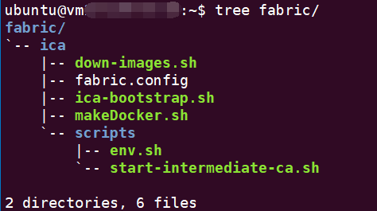

# fabric-ca

假设你已经配置go、docker环境，并设置相关环境变量。
如果没有，请参考：[>> README](https://github.com/fnpac/fabric-samples-cn/blob/master/README.md)

通过如下脚本下载所需的所有镜像：

```bash
./down-images.sh
```

## 使用步骤

请使用如下命令为脚本增加执行权限：

```bash
root@vm10-249-0-4:~/fabric-web/fabric-ca# chmod +x *.sh
root@vm10-249-0-4:~/fabric-web/fabric-ca# 
root@vm10-249-0-4:~/fabric-web/fabric-ca# 
root@vm10-249-0-4:~/fabric-web/fabric-ca# chmod +x scripts/*.sh
```

### 0. 网络拓扑

通过`fabric.config`定义网络拓扑结构

### 1.构建项目，为不同节点打包脚本

```bash
./network_builder.sh
```

再正式开始前，确保你已经正确完成下列步骤执行：

为了方便起见，我们拿代码中提供的示例`fabric.config`配置文件做说明：
    
* 将`build`目录下生成的文件夹分别拷贝到相应节点的 **_`fabric.config`配置中指定用户的指定目录_** 下；
    
    ```bash
    scp -r ica ubuntu@<IP>:~/fabric/ica
    scp -r rca  ubuntu@<IP>:~/fabric/rca
    scp -r peer  ubuntu@<IP>:~/fabric/peer
    scp -r orderer  ubuntu@<IP>:~/fabric/orderer
    ```
    
    目录应该是这个样子：
    
    
    
* 每个节点都已下载所需的fabric镜像；

    可执行如下命令下载镜像:
    
    ```bash
    ./down-images.sh
    ```

### 2.启动CA服务

对于每一个组织都要启动一个rca和ica服务。

##### 2.1. rca(root ca)

一个组织对应一个 **_root fabric-ca-server_**

启动指定组织`<ORG>`的 **_root fabric-ca-server_** 命令如下

```bash
./rca-bootstrap.sh <ORG>
```

脚本会在root CA 初始化时，在`/etc/hyperledger/fabric-ca`目录下生成`ca-cert.pem`证书，并将其拷贝为`/${DATA}/${ORG}-ca-cert.pem`。

##### 2.2. ica(intermediate ca)

一个组织对应一个 **_intermediate fabric-ca-server_**

启动指定组织`<ORG>`的 **_intermediate fabric-ca-server_** 命令如下

```bash
./ica-bootstrap.sh <ORG>
```

脚本会在intermediate CA 初始化时，在`/etc/hyperledger/fabric-ca`目录下生成`ca-chain.pem`证书，并将其拷贝为`/${DATA}/${ORG}-ca-chain.pem`。

>其它节点下列操作需要使用rca(`USE_INTERMEDIATE_CA`为`false`时)或者ica(`USE_INTERMEDIATE_CA`为true`时)根证书
>
>- 向CA服务端申请根证书时使用;
>- 向CA服务端登记CA管理员身份时使用;
>    
>    之所以*登记CA管理员身份*，是因为需要使用CA管理员身份去注册orderer和peer相关用户实体。
>    
>    **_!!! 执行注册新用户实体的客户端必须已经通过登记认证，并且拥有足够的权限来进行注册 !!!_**
>
>- 向CA服务端登记 **_Orderer组织管理员身份和Peer组织管理员身份_**、**_Orderer节点身份和Peer节点身份_**，以及 **_Peer组织普通用户身份_** 时使用;

因此，

- `USE_INTERMEDIATE_CA`为`false`，即未启用中间层CA时，**_需要将`/etc/hyperledger/fabric-ca/ca-cert.pem`拷贝到其它节点作为`CA_CHAINFILE`_**；
- `USE_INTERMEDIATE_CA`为`true`，即启用中间层CA时，**_需要将`/etc/hyperledger/fabric-ca/ca-chain.pem`拷贝到其它节点作为`CA_CHAINFILE`_**;

不必担心，这些工作脚本已经帮我们完成了！~ :laughing: 

采用的方法是其它节点通过 **_ssh远程拷贝ca上的根证书_** ，所以我们在`fabric.config`中配置了CA的`USER_NAME`、`PATH`，
但这需要你在脚本执行的过程中与脚本交互，输入对应CA服务器的密码，如果你想避免这一步骤，可以考虑配置ssh免登陆。 

> 💡 !!!确保:
> - CA服务端开启22端口；
> - CA服务端的DATA目录的所有者为`fabric.config`中的`CA.USER_NAME`，否则无法远程获取上述证书(为确保这一点，请不要使用`sudo`启动脚本)；

同样的，还有`setup`节点，不再赘述。

- `orderer`节点需要从`setup`节点获取创世区块
- `run`节点需要从`setup`节点获取应用通道配置交易文件、锚节点配置更新交易文件

这些工作脚本也已经帮我们完成了！~ ✌ 

### 3. 启动setup

setup容器用于：

- 向中间层fabric-ca-servers注册Orderer和Peer身份
- 构建通道Artifacts（包括：创世区块、应用通道配置交易文件、锚节点配置更新交易文件）
- 启动'run'容器，执行创建应用通道、加入应用通道、更新锚节点、安装链码、实例化链码、查询调用链码等操作

> 务必在执行完步骤2，再执行此步骤。确保已成功启动所有组织的`rca`、`ica`节点。

```text
setup-bootstrap.sh [-h] [-?] [-d]
            -h|-?       获取此帮助信息
            -d          从网络下载二进制文件
```

* 脚本需要使用fabric的二进制文件`configtxgen`，请将这些二进制文件置于PATH路径下。

    如果脚本找不到，会基于[fabric源码](https://github.com/hyperledger/fabric)自动编译生成二进制文件，
    此时需要保证`$HOME/gopath/src/github.com/hyperledger/fabric`源码存在，且版本一致。
    
    当然你也可以通过指定`-d`选项从网络下载该二进制文件

* ~~脚本需要使用fabric的二进制文件`fabric-ca-client`，请将该二进制文件置于PATH路径下~~。

    ~~如果脚本找不到，会基于[fabric ca源码](https://github.com/hyperledger/fabric-ca)自动编译生成二进制文件，
    此时需要保证`$HOME/gopath/src/github.com/hyperledger/fabric-ca`源码存在，且版本一致。~~

    ~~编译`fabric-ca`相关代码，需要一些依赖包，可以通过如下命令安装:~~

    ```bash
    sudo apt-get install libtool libltdl-dev
    ```

    ~~脚本会将编译生成的`fabric-ca-server`和`fabric-ca-client`保存在`$GOPATH/bin`目录下。~~

* 此外，你还需要配置当前机器的`/etc/host`，内容参见`build/host.config`。
* 将安装的链码复制到'setup'同级目录下。

如果你执行完上述，那么来启动`setup`吧！~😍

```bash
./setup-bootstrap.sh
```

### 4. 启动orderer

```text
orderer-bootstrap.sh [-h] [-?] <ORG> <NUM>
    -h|-?  - 获取此帮助信息
    <ORG>   - 启动的orderer组织名称
    <NUM>   - 启动的orderer组织的第几个节点
```

```bash
./orderer-bootstrap.sh <ORG> <NUM>
```

### 5. 启动peer

```text
peer-bootstrap.sh [-h] [-?] <ORG> <NUM>
    -h|-?  - 获取此帮助信息
    <ORG>   - 启动的peer组织的名称
    <NUM>   - 启动的peer组织的节点索引
```

```bash
./peer-bootstrap.sh <ORG> <NUM>
```

## TODO

- orderer增加kafka集群
- 账本存储使用couchdb

## 版本历史

### v1.0.1

* 新增`expect`，免去手动输入密码的烦恼；